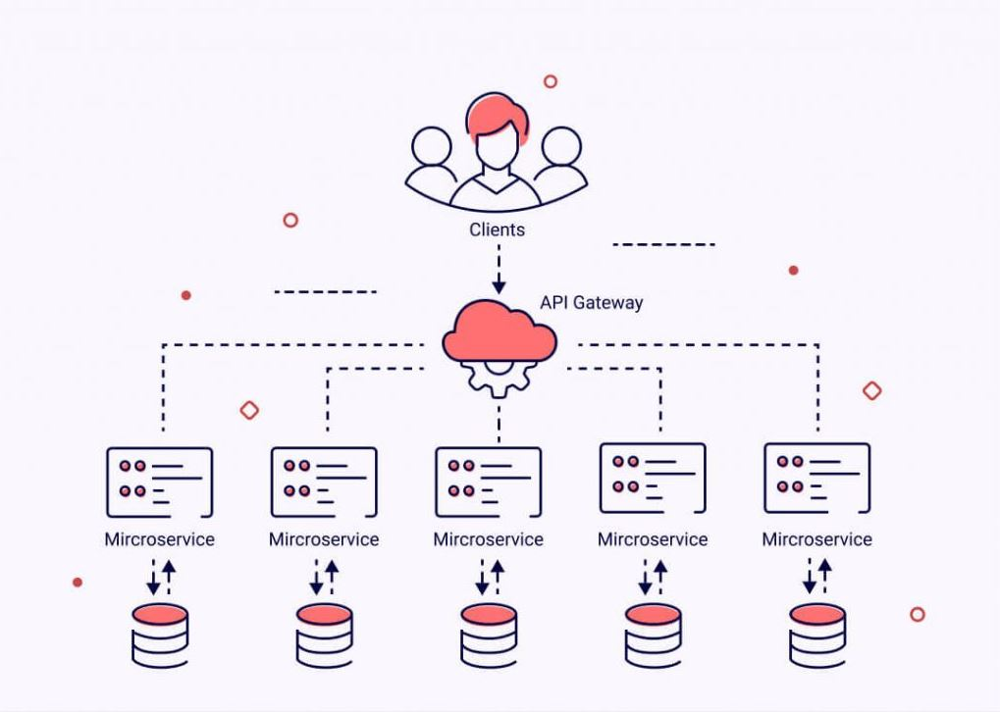
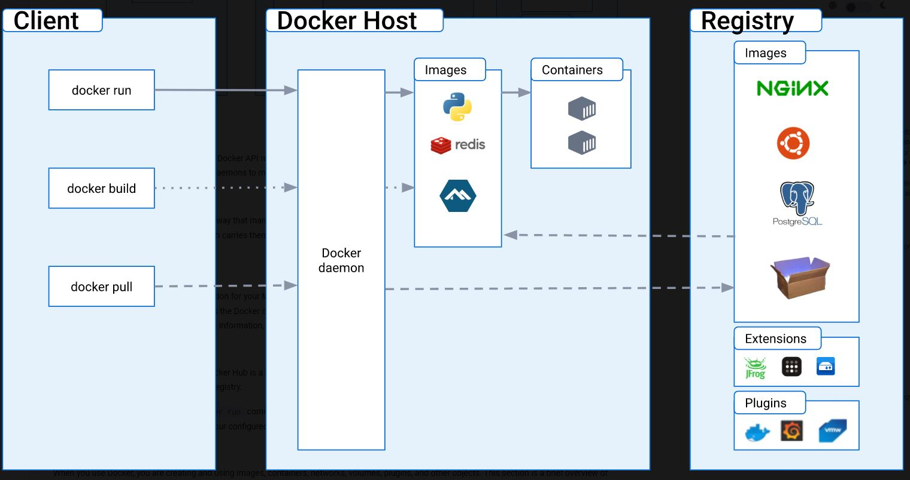

# Microservices Architecture with Docker and K8

## What are Microservices

Microservices is a type of pplication architecture where a collection of independent services communicate through a well defined API.

Microservices architectures make applications easier to scale and faster to develop, enabling innovation and accelerating time-to-market for new features.

Microservices is a cloud-native approach to building software in a way that allows each core function within an application to exist independently. For example, an onlain retailer can have a search bar, a rcommended section, a shopping cart, etc. All those functions are individual microservices that work together and create a complete application.

## Difference between 2/Ntier architecture and microservices 

In a 2-tier architecture our application and database are deployed on a two separate machines, so if one machine fails, for example database, our app machine is still running. However there are still some limitations: 

* if the app machine fails, then the entire application stops working
* if we want to scale one process within our application it means the entire application needs to be scaled as well

With microservices each process runs individually, means if one process fails or needs to be scaled it can be done just to this one specific process without affecting the application as a whole.

## What is Docker?

Docker is a software platform that allows you to build, test, and deploy applications quickly. Docker packages software into standardized units called containers that have everything the software needs to run including libraries, system tools, code, and runtime. Using Docker allows you to quickly deploy and scale applications into any environment and know that code will run.

## What is Containerization?

Containerization is a softwrae deployment process that bundles an application's code with all the files and dependancies (such as libraries) it needs to run on any infrastructure. For example, to run an application on Windows you might need to install a software package on a Windows machine. However, with containerization it will create a single package, knows as container, that can run on all types of devices and operating systems.

Benefits:

* Portability - helps to deploy the software in multiple environments without the need of changing code
* Scalability - containers are much lighter and easier to run, as they contain only what is neccessary for an application to run
* Fault tolerance - multiple containers used to run microservices that work individualy, meaning a single fault container wont affect the rest of the containers
* Agility - application runs in isolated computing environment, meaning developers can troubleshoot and change the code without interfering with other services.

## Virtualization vs Containerization

Virtualization or VM is a digital copy of the host machine, with it's own dedicated computing resources and OS, managed by Hypervisor. 

Containainerization is an improved concept of VM, where it doesn't require an OS layer inside the container. It allows the application to run independently from the host OS, as container already contains all the required resources it needs to run the application. Also due to container's lightweight it prevents resource waste.

## Using docker to pull an Image from registry and launch the container

`Docker pull` - it pulls an image from the DockerHub registry to our local repository so it can be accessed quicker

`Docker build` - it builds an image localy

`Docker run` - it checks if the image is available locally, if not it will pull it from the registry, and then it will build it and run it

### To run the container
1. Use GitBash terminal
2. `docker run hello-world` -  test a connection with docker registry

3. `docker images` - list of the images locally

4. `docker run -d -p 80:80 nginx` - run an nginx image on port 80 on our local host:
    * `-d` - run on the background
    * `-p` - port

Once container is running you can go to the `localhost` page in your browser to check if the nginx is running

5. `docker ps` - check active containers

6. `docker stop <ps_id>` - stop container

7. `docker start <ps_id>` - start container

8. `docker rm <ps_id> -f` - terminate container, where `-f` is optional as it forces the command

9. `alias docker="winpty docker"` - create alias with docker

10. `docker exec -it 201d5464c0f2 sh` - connect to the container using shell `sh`. `exec -it` means interactive mode

11. `cd /usr/share/nginx/html` - nagivate inside the html folder

12. `apt-get update -y` - do updates
13. `apt-get upgrade -y` - do upgrades
14. `apt-get install sudo -y` - install sudo
15. `sudo apt install nano -y` - install nano
16. `sudo nano index.html` - open index.html page
17. Change the `h1` heading and save the file
18. Refresh the browser to see a new h1 heading
